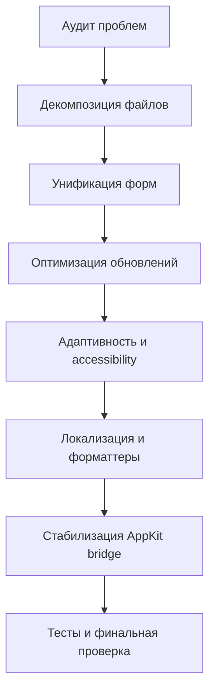

# План устранения проблем в SwiftUI-отображении

## Цель

Привести слой отображения к более устойчивой архитектуре SwiftUI: уменьшить связанность, убрать дублирование интерфейса, снизить избыточные перерисовки, улучшить адаптивность и подготовить UI к локализации.

## Область изменений

- `TimeDrive/TimeDrive/ContentView.swift`
- `TimeDrive/TimeDrive/TimeDriveApp.swift`
- Новые файлы в feature-структуре для экрана дашборда, задач, проектов и настроек

## Принципы выполнения

- Разделение по responsibility: View отдельно, ViewModel отдельно, переиспользуемые UI-компоненты отдельно.
- Минимизация дублирования через общие формы и общие секции.
- Уменьшение частоты и области UI-обновлений.
- Локализация всех пользовательских строк.
- Пошаговая миграция с сохранением текущего поведения.

## Этапы

### Этап 1. Декомпозиция большого файла

1. Выделить модели и enum для UI в отдельные файлы:
   - `TaskFilter`
   - `DashboardPanel`
   - `SyncStatusSnapshot`
2. Вынести ViewModel из `ContentView.swift` в отдельные файлы:
   - `TimerScreenViewModel.swift`
   - `TasksViewModel.swift`
   - `ProjectsViewModel.swift`
   - `SettingsViewModel.swift`
3. Разделить View-слой на отдельные файлы:
   - `TimerDashboardView.swift`
   - `TimerHeaderView.swift`
   - `DashboardBodyView.swift`
   - `CompactTasksPanel.swift`
   - `CompactProjectsPanel.swift`
   - `CompactSettingsPanel.swift`
   - `Shared/CompactEmptyState.swift`
   - `Shared/PanelSectionStyle.swift`

Критерий готовности:
- `ContentView.swift` содержит только корневую композицию экрана и не содержит реализаций крупных дочерних сущностей.

### Этап 2. Устранение дублирования экранов и форм

1. Создать переиспользуемый компонент формы задачи:
   - `TaskEditorSheet.swift`
   - единые поля, валидация, обработчики Cancel и Save
2. Создать переиспользуемый компонент формы проекта:
   - `ProjectEditorSheet.swift`
3. Удалить дублирующие блоки в compact и full представлениях, подключить общие компоненты.
4. Унифицировать отображение ошибок через общий view-компонент:
   - `InlineErrorView.swift`

Критерий готовности:
- Логика форм и ошибок описана в одном месте и используется в обоих режимах отображения.

### Этап 3. Оптимизация обновлений состояния и перерисовок

1. Пересмотреть подход с секундным тикером:
   - оставить тики только для видимых и зависимых частей таймера
   - исключить обновление несвязанных панелей
2. Выделить в `TimerHeaderView` узкий источник данных, чтобы не триггерить перерисовку всего дерева.
3. Проверить, где оправдано применение `@ObservedObject`, и уменьшить количество подписок на верхнем уровне.

Критерий готовности:
- При работе таймера обновляется только необходимая часть UI.

### Этап 4. Улучшение адаптивности и accessibility

1. Ослабить жесткий layout:
   - убрать строгую фиксацию ширины там, где это не требуется
   - добавить ограничения через `min` и `max` и поддержать Dynamic Type
2. Проверить длинные названия задач, ошибок и локализованных строк.
3. Уточнить accessibility labels для кнопок действий и переключателей панелей.

Критерий готовности:
- Интерфейс корректно масштабируется при изменении размера окна и размера шрифта.

### Этап 5. Локализация и форматтеры

1. Вынести пользовательские строки в `Localizable.strings`.
2. Заменить хардкод строк в представлениях на локализованные ключи.
3. Вынести `DateFormatter` для last sync в кэшируемый статический formatter или в отдельный форматтер-сервис.

Критерий готовности:
- В UI нет хардкода пользовательских строк.
- Форматирование дат не создает новый formatter на каждый вызов.

### Этап 6. Интеграция AppKit-bridge более безопасным способом

1. Проанализировать необходимость `WindowAccessor` в текущем виде.
2. Если мост обязателен, изолировать side effects и исключить повторные attach в цикле обновлений.
3. Добавить защиту от повторной конфигурации окна и документировать жизненный цикл.

Критерий готовности:
- Побочные эффекты управления окном контролируемы и не зависят от частоты рендера SwiftUI.

### Этап 7. Валидация качества

1. Добавить тесты на ViewModel-валидации форм и обработку ошибок.
2. Добавить UI-проверки для ключевых сценариев:
   - запуск и пауза таймера
   - создание задачи
   - создание проекта
   - синхронизация
3. Провести ручную проверку интерфейса на разных состояниях таймера.

Критерий готовности:
- Основные сценарии покрыты автопроверками и подтверждены визуальной проверкой.

## Порядок внедрения по PR

1. PR-1: декомпозиция файлов без изменения поведения.
2. PR-2: унификация форм и ошибок.
3. PR-3: оптимизация тиков и перерисовок.
4. PR-4: адаптивность и accessibility.
5. PR-5: локализация и форматтеры.
6. PR-6: стабилизация AppKit-bridge и финальные тесты.

## Mermaid схема потока работ

## Чеклист готовности

- Нет крупной бизнес и UI логики в одном файле.
- Нет дублирования форм создания сущностей.
- Обновления таймера не перерисовывают несвязанные панели.
- Строки локализованы.
- Форматтеры переиспользуются.
- Поведение окна стабильно в жизненном цикле SwiftUI.
