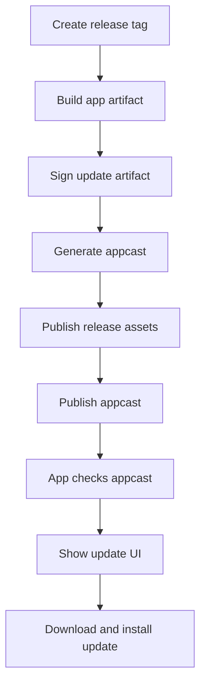

# План внедрения автообновления через GitHub Releases

## 1. Принятые допущения

- Приложение распространяется вне Mac App Store
- Источник релизов: GitHub Releases
- Канал обновлений: stable
- Обновление в приложении: автоматическая проверка + ручная проверка из настроек

## 2. Целевой подход

Использовать Sparkle 2 как встроенный механизм обновлений для macOS:

- приложение читает appcast-ленту
- appcast указывает на подписанный архив новой версии
- Sparkle показывает окно обновления и устанавливает новую версию

## 3. Изменения в проекте

### 3.1 Зависимость и конфигурация приложения

- Подключить Sparkle 2 через SPM в Xcode проект
- Добавить в Info.plist ключи Sparkle:
  - URL appcast
  - публичный EdDSA ключ
  - параметры проверки обновлений
- Добавить сервис-обертку над Sparkle (например UpdateService)
- Инициализировать сервис на старте приложения
- Добавить в UI настроек:
  - кнопка Проверить обновления
  - переключатель Автоматически проверять обновления

### 3.2 Релизный pipeline

- Дополнить текущий release pipeline генерацией appcast
- В релиз прикладывать архив обновления
- Подписывать архив приватным Sparkle-ключом
- Публиковать/обновлять appcast рядом с релизами

### 3.3 Хостинг appcast

Варианты:

1) GitHub Pages
- appcast.xml размещается на Pages
- артефакты лежат в GitHub Releases

2) Отдельный статический хост
- appcast.xml и архивы на CDN/S3

Рекомендуется GitHub Pages как самый простой старт.

## 4. Изменения CI и секретов

- Добавить секрет приватного Sparkle ключа в GitHub Actions
- Добавить шаги в release workflow:
  - скачать/подготовить артефакт обновления
  - подписать артефакт
  - собрать appcast.xml
  - опубликовать appcast
- Добавить валидацию:
  - appcast доступен по URL
  - сигнатура валидна
  - версия в appcast совпадает с тегом релиза

## 5. Безопасность

- Приватный ключ хранить только в secrets CI
- Публичный ключ хранить в приложении
- Проверять HTTPS для appcast URL
- Запретить неподписанные обновления
- Отдельно продумать rotation ключа (runbook)

## 6. UX и поведение

- Фоновая проверка при старте и периодически
- Ручная проверка в настройках
- Показ release notes в окне обновления
- Корректная обработка ошибок сети и недоступности appcast

## 7. Тестовый план

- Локально:
  - smoke проверка кнопки Проверить обновления
  - проверка реакции на отсутствие сети
- Стейджинг канал:
  - тестовый appcast с prerelease версией
  - проверка установки обновления поверх предыдущей версии
- Регресс:
  - целостность пользовательских данных после обновления
  - запуск приложения после апдейта

## 8. План отката

- Удалить проблемную запись из appcast
- Перепубликовать appcast на последнюю стабильную версию
- При необходимости снять релизный артефакт
- Выпустить hotfix-версию с корректной сигнатурой

## 9. Mermaid схема

## 10. Передача в Code режим

1. Подключить Sparkle в проект и базовую конфигурацию
2. Добавить UpdateService и интеграцию в App lifecycle
3. Добавить элементы UI для ручной проверки и автопроверки
4. Расширить scripts/release_local.sh и scripts/release_ci.sh под подпись и appcast
5. Обновить .github/workflows/release.yml публикацией appcast
6. Обновить документацию релизов и обновлений
