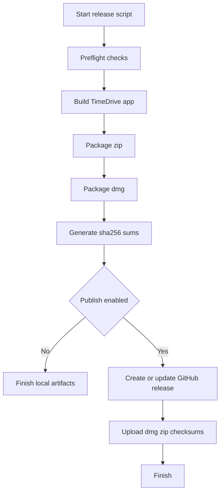

# План релизного скрипта для публикации installable-версии в GitHub

## 1. Цель

Собрать предсказуемый pipeline для macOS-приложения TimeDrive, который:
- собирает релизный `.app`
- упаковывает установочный артефакт `.dmg` и дополнительный `.zip`
- генерирует checksum-файл
- публикует артефакты в GitHub Releases по тегу версии

## 2. Контекст проекта

- Основной таргет приложения: `TimeDrive`
- Проект: `TimeDrive.xcodeproj`
- Продукт: `TimeDrive.app`

## 3. Структура файлов

- `scripts/release_local.sh` — локальная сборка и упаковка
- `scripts/release_ci.sh` — CI-обертка для GitHub Actions
- `.github/workflows/release.yml` — автопубликация релиза по тегу
- `dist/` — выходные артефакты
  - `TimeDrive.app`
  - `TimeDrive.dmg`
  - `TimeDrive.zip`
  - `SHA256SUMS.txt`

## 4. Входные параметры скрипта

- `VERSION` — версия релиза в формате `vX.Y.Z`
- `SCHEME` — по умолчанию `TimeDrive`
- `CONFIGURATION` — по умолчанию `Release`
- `EXPORT_METHOD` — стратегия экспорта для macOS app
- `APPLE_ID`, `TEAM_ID`, `NOTARY_KEYCHAIN_PROFILE` — только для notarization
- `GITHUB_TOKEN` — только для публикации релиза

## 5. Preflight-проверки

Перед сборкой скрипт проверяет:
- наличие `xcodebuild`
- наличие `ditto`, `hdiutil`, `shasum`
- доступность `gh` для публикации релиза
- наличие тега версии или переданного `VERSION`
- наличие и корректность `TimeDrive.xcodeproj`
- что схема `TimeDrive` видима для сборки

Если любая проверка не проходит, скрипт завершает выполнение с понятным сообщением об ошибке.

## 6. Пошаговый pipeline

1. Очистка временных каталогов сборки
2. Сборка `TimeDrive.app` в `Release`
3. Копирование app в `dist/TimeDrive.app`
4. Упаковка `dist/TimeDrive.zip`
5. Создание `dist/TimeDrive.dmg`
6. Генерация `dist/SHA256SUMS.txt`
7. Валидация наличия всех ожидаемых файлов
8. Публикация в GitHub Release при наличии флага publish

## 7. Публикация в GitHub Release

- Релиз создается по тегу `VERSION`
- Заголовок релиза совпадает с тегом
- В релиз прикрепляются:
  - `TimeDrive.dmg`
  - `TimeDrive.zip`
  - `SHA256SUMS.txt`
- В notes добавляется краткая инструкция по установке и проверке checksum

## 8. Подпись и notarization, опциональный этап

В production-конфигурации добавить:
- codesign для `TimeDrive.app`
- notarization через `xcrun notarytool`
- stapler для финального `.app`
- затем упаковка `.dmg` и `.zip`

Этот этап включается флагом, чтобы не блокировать базовую локальную сборку.

## 9. Обработка ошибок и надежность

- `set -euo pipefail`
- единый `trap` для диагностики и очистки временных файлов
- проверка каждого созданного артефакта по факту появления
- человекочитаемые коды выхода по типу ошибки:
  - ошибка окружения
  - ошибка сборки
  - ошибка упаковки
  - ошибка публикации

## 10. Mermaid-схема процесса

## 11. Критерии готовности

- Один запуск скрипта генерирует полный набор файлов в `dist/`
- Артефакты прикрепляются к GitHub Release без ручных шагов
- Логи скрипта позволяют быстро найти причину сбоя
- Версия релиза однозначно соответствует git-тегу

## 12. Что передать в Code режим

1. Создать `scripts/release_local.sh`
2. Создать `scripts/release_ci.sh`
3. Создать `.github/workflows/release.yml`
4. Добавить раздел Release в `README.md`
5. Проверить локальный dry-run без публикации
6. Проверить публикацию по тестовому тегу
